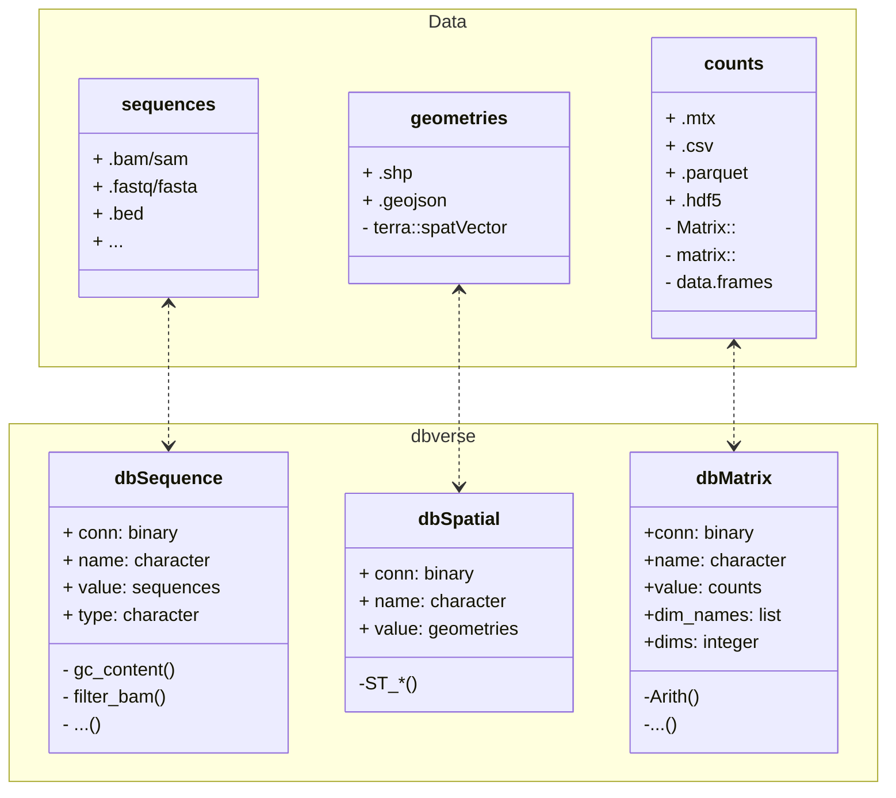

# dbverse

Note: dbverse is still in early development. changes to the below are likely to occur.

## Class Diagram

```mermaid
classDiagram

namespace Data {
    class sequences{
        + .bam/sam
        + .fastq/fasta
        + .bed 
        + ...
    }

    class counts{
        + .mtx
        + .csv
        + .parquet
        + .hdf5
        - Matrix::
        - matrix::
        - data.frames
    }

    class geometries{
        + .shp
        + .geojson
        - terra::spatVector
    }

}

namespace dbverse {
    class dbSequence {
        + conn: binary
        + name: character
        + value: sequences
        + type: character
        - gc_content()
        - filter_bam()
        - ...()
    }


    class dbSpatial{
        + conn: binary
        + name: character
        + value: geometries
        -ST_*()
    }


    class dbMatrix {
        +conn: binary
        +name: character
        +value: counts
        +dim_names: list
        +dims: integer
        -Arith()
        -...()
    }
}

sequences <..> dbSequence
counts <..> dbMatrix
geometries <..> dbSpatial
```

## Description
TODO: More text on the structure of the dbverse ecosystem.

